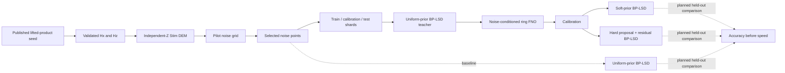

# qLDPC-FNO

Quantum information is fragile: unwanted interactions can change a physical
qubit, while directly inspecting an unknown quantum state would destroy the
information one is trying to protect. Quantum error correction addresses this by
spreading logical information across many physical qubits and measuring
parity-like constraints instead of the logical state itself.

Those measurements produce a **syndrome**—a compact fingerprint of which
constraints were disturbed. Decoding is the classical task of turning that
fingerprint into a correction. The correction must reproduce the measured
syndrome and preserve the encoded logical information; merely resembling another
decoder's bit string is not enough.

Surface-code architectures are the standard local-check reference point, but
their low encoding rate can make physical-qubit overhead important when many
logical qubits are needed. qLDPC codes explore a different tradeoff: sparse checks
with potentially higher encoding rate, usually at the cost of less local
connectivity. This project studies the cyclic lifted-product code `lp(3,7)_16`
from the [source-locked qLDPC paper](https://arxiv.org/abs/2603.28627v1), without
claiming that one code settles the broader architecture question.

The code's repeating length-45 structure makes a Fourier neural operator (FNO) a
plausible way to learn structured decoder priors. BP-LSD remains the conventional
decoder: belief propagation uses the sparse check graph, and localized-statistics
decoding supplies a fallback when message passing is insufficient. The
accuracy-first hypothesis is not that an FNO should replace those constraints,
but that it may help BP-LSD by supplying better soft priors or a proposal that
BP-LSD repairs.

The implemented campaign therefore compares:

1. BP-LSD with a uniform physical-error prior;
2. BP-LSD with per-qubit soft priors from a noise-conditioned Fourier neural
   operator (FNO); and
3. a thresholded FNO proposal followed by BP-LSD repair of the residual syndrome.

Development smoke runs exposed the central failure mode: high agreement with
BP-LSD's correction bits can coexist with failed syndrome checks. Those run
artifacts are not committed, so a fresh clone cannot audit a particular numeric
result. The durable lesson is encoded in the pipeline: teacher-bit accuracy is a
training diagnostic, syndrome validity is reported explicitly, and the planned
final comparison will count invalid corrections as block failures. Speed comes
only after accuracy and validity.

> **Status:** the smoke pipeline is complete. The accuracy campaign currently
> implements pilot selection, role-separated data generation, resumable teacher
> generation and FNO training, and independent calibration of both hybrid
> methods. A final held-out evaluator that compares all three methods is not yet
> present, so this repository does not claim that either learned method improves
> accuracy or latency over uniform BP-LSD.

## Why this pairing?

Lifted-product checks repeat under cyclic shifts. The ring FNO applies the same
learned rule at each cyclic position and mixes long-range information through a
small set of Fourier modes. That structural match makes the model a reasonable
prior generator, but it does not make the model a decoder by itself: an
unconstrained thresholded output need not satisfy the syndrome.

BP-LSD supplies the missing algebraic discipline. It is a strong baseline, but it
performs iterative graph decoding and may invoke a localized fallback for each
shot. Whether an FNO prior improves accuracy, reduces decoder work, or only adds
overhead is an empirical question. This repository measures correctness before
making any timing comparison.

Read [Research background](docs/background.md) for the full motivation,
[Concepts](docs/concepts.md) for the vocabulary, and
[Experiment methodology](docs/experiment-methodology.md) for the exact implemented
study.

## Experiment flow



The code-capacity model applies independent physical Z errors with perfect
syndrome measurements. `Hx` maps a Z-error vector to its syndrome. The code's
`ell = 45` cyclic coordinate reshapes 945 syndrome bits into 21 channels and
2,610 correction bits into 58 channels. Campaign training adds the physical
error rate's log-odds, broadcast over the ring, as a 22nd input channel.

## Quickstart

### 1. Install and check the environment

The project requires Python `>=3.14,<3.15` and uses a committed `uv.lock`.
Install [`uv`](https://docs.astral.sh/uv/), then run:

```bash
uv sync --all-groups
uv run pytest -q
uv run ruff check .
```

### 2. Exercise the complete smoke pipeline

The canonical smoke run uses 512 shots and 600 optimization steps:

```bash
bash scripts/run_smoke.sh
```

For a quick CLI execution check, use a fresh output directory and explicitly
reduce the work:

```bash
SMOKE_OUTPUT=artifacts/quick \
SMOKE_SHOTS=16 \
SMOKE_STEPS=2 \
bash scripts/run_smoke.sh
```

Setting `SMOKE_STEPS` disables the canonical overfit gates. The reduced command
checks that every stage executes; its metrics are not scientific decoder results.
Without that override, the script enforces all training gates and stops before
held-out evaluation if any gate fails. The smoke orchestrator refuses to overwrite
an existing output directory.

### 3. Understand the accuracy-campaign stages

The campaign is intentionally exposed as individual, potentially
resource-intensive stages. The commands below are the implemented stage map,
using the committed full campaign configuration:

```bash
uv run python experiments/00_lock_sources.py \
  --out artifacts/accuracy-campaign/source-lock.json
uv run python experiments/01_build_lp_codes.py \
  --out artifacts/accuracy-campaign/code
uv run python experiments/02_validate_lp_codes.py \
  --code artifacts/accuracy-campaign/code

uv run python experiments/13_pilot_noise_grid.py \
  --config configs/accuracy_campaign.json \
  --code artifacts/accuracy-campaign/code \
  --out artifacts/accuracy-campaign/pilot

uv run python experiments/14_generate_campaign_shards.py \
  --config configs/accuracy_campaign.json \
  --code artifacts/accuracy-campaign/code \
  --selection artifacts/accuracy-campaign/pilot/selection.json \
  --role train \
  --out artifacts/accuracy-campaign/train

uv run python experiments/14_generate_campaign_shards.py \
  --config configs/accuracy_campaign.json \
  --code artifacts/accuracy-campaign/code \
  --selection artifacts/accuracy-campaign/pilot/selection.json \
  --role calibration \
  --out artifacts/accuracy-campaign/calibration

uv run python experiments/15_train_conditional_fno.py \
  --config configs/accuracy_campaign.json \
  --code artifacts/accuracy-campaign/code \
  --train artifacts/accuracy-campaign/train \
  --out artifacts/accuracy-campaign/model

uv run python experiments/16_calibrate_hybrid_priors.py \
  --config configs/accuracy_campaign.json \
  --code artifacts/accuracy-campaign/code \
  --calibration artifacts/accuracy-campaign/calibration \
  --model artifacts/accuracy-campaign/model \
  --out artifacts/accuracy-campaign/calibration
```

`experiments/14_generate_campaign_shards.py` also accepts `--role test`, but no
campaign test evaluator consumes those shards yet. The configuration permits up
to 50,000 training shots, 10,000 calibration shots, and 60 training epochs;
review [Reproducibility](docs/reproducibility.md) before starting a long run.

## Methods and success criteria

The campaign keeps the code, noise model, data selection, BP-LSD configuration,
and split provenance fixed while changing how the decoder receives its prior:

| Method | Prior or proposal | Syndrome enforcement |
| --- | --- | --- |
| Uniform BP-LSD | One physical Z-error rate for every qubit | BP-LSD |
| Soft-prior BP-LSD | Calibrated per-qubit FNO probabilities | BP-LSD |
| Proposal + residual BP-LSD | Thresholded FNO correction; uncertainty prior on the residual problem | BP-LSD repair |

The accuracy hierarchy used by learned smoke evaluation, hybrid calibration, and
the planned final comparison is:

1. **Syndrome validity:** does `Hx @ correction mod 2` equal the observed syndrome?
2. **Logical block-error rate:** does any predicted logical observable differ from
   the sampled one? Learned smoke evaluation and hybrid calibration include
   syndrome-invalid outputs among block failures; the planned final comparison
   will apply that rule to every method.
3. **Uncertainty:** report error counts and a 95% Wilson interval where implemented.
4. **Diagnostics:** convergence, teacher-bit accuracy, negative log-likelihood,
   correction weights, and related intermediate measures.
5. **Timing:** report the measured batch and decoder components only after the
   accuracy comparison is valid; do not generalize one machine's timing.

The current pilot is a preselection stage, not the final comparison: its baseline
`block_errors` field counts observable mismatches, while syndrome validity is
reported separately. Pilot rows should therefore be used to select a noise range,
not as final accuracy evidence.

See [Experiment methodology](docs/experiment-methodology.md) for the exact model,
decoder settings, data roles, and calibration rule.

## Scientific boundary

This repository studies one CSS sector of `lp(3,7)_16` under independent Z errors
and perfect syndrome measurement. It is a code-capacity study, not a reproduction
of the source paper's circuit-level neutral-atom noise, repeated measurement
rounds, leakage, surgery gadgets, or five-candidate decoder ensemble.

The suffix `16` is the source paper's **distance upper bound**. The repository
does not claim that the code's exact distance is 16. It also does not claim that
matching a BP-LSD teacher is equivalent to decoding successfully, that the FNO
generalizes outside the selected noise range, or that a calibrated method wins on
held-out data before the missing final evaluator is implemented and run.

The Google Quantum AI Willow dataset is source-locked for future work but is not
mixed into this qLDPC experiment. It is surface-code hardware data and belongs in
a separate temporal-drift/generalization study with its own adapter, split policy,
and provenance chain.

## Repository map

| Path | Purpose |
| --- | --- |
| `configs/` | Pinned smoke and accuracy-campaign policies |
| `experiments/` | Numbered, single-stage command-line entry points |
| `scripts/run_smoke.sh` | End-to-end smoke orchestrator |
| `src/qldpc_fno/codes/` | Lifted-product construction and GF(2) operations |
| `src/qldpc_fno/stim/` | Detector-error-model and packed-sample utilities |
| `src/qldpc_fno/decoders/` | Uniform and hybrid BP-LSD implementations |
| `src/qldpc_fno/models/` | One-dimensional ring FNO |
| `src/qldpc_fno/campaign/` | Configuration, seeds, shards, and provenance checks |
| `src/qldpc_fno/training/` | Smoke and conditional training/calibration logic |
| `src/qldpc_fno/metrics/` | Syndrome and logical block-level scoring |
| `tests/` | Unit and integration tests, including corruption/restart checks |
| `docs/` | Concepts, methodology, and reproducibility guides |

## Artifacts, provenance, and restart behavior

Every substantial array or binary artifact is accompanied by canonical JSON
metadata and SHA-256 hashes. Smoke stages verify their content and source hashes,
but their manifests do not record a Git commit. Campaign shard provenance binds
payload hashes to the config and code, role, and rate/seed coordinates; the role
completion manifest hashes every shard manifest. Shard publication does not record
Git identity.

Smoke stages are immutable and have no resume mode: choose a new output path.
Campaign training introduces Git-commit binding in addition to config, code, and
train-shard hashes. It generates BP-LSD teacher corrections in verified chunks,
writes atomic epoch checkpoints, and resumes only when `--resume` is explicit and
that training identity still matches. See
[Reproducibility](docs/reproducibility.md) for safe restart commands and the
artifact contract.

## Roadmap

- Complete the held-out campaign evaluator for uniform BP-LSD, soft-prior BP-LSD,
  and proposal + residual BP-LSD on identical test shards.
- Add sequential test sampling toward the configured failure target and maximum
  shot cap, with Wilson intervals and accuracy-first stopping semantics.
- Report comparable timing components only for accuracy-eligible methods.
- Treat Willow/temporal work as a separate study: add a hardware-data adapter,
  temporal splits, drift tests, and independent provenance without combining it
  with the qLDPC code-capacity campaign.

## Sources

The experiment writes these exact references to `source-lock.json`:

- [Primary qLDPC paper, arXiv:2603.28627v1](https://arxiv.org/abs/2603.28627v1)
- [Stim 1.16.0](https://github.com/quantumlib/Stim/tree/v1.16.0)
- [`ldpc` 2.4.1](https://pypi.org/project/ldpc/2.4.1/)
- [Google Quantum AI Willow dataset, Zenodo 10.5281/zenodo.13273331](https://zenodo.org/records/13273331)

When reporting results, cite the underlying paper and software or dataset sources
appropriate to the experiment, and retain the generated source lock and manifests
with the result artifacts.
