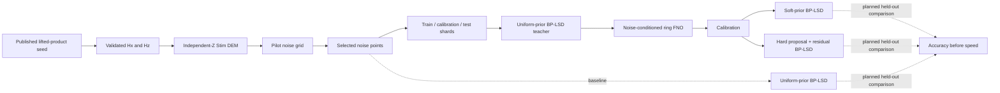

# qLDPC-FNO

Can a neural operator improve quantum-error-correction decoding without ignoring
the algebraic constraints enforced by a conventional decoder?

This repository is a reproducible research pipeline for that question on the
canonical `lp(3,7)_16` quantum low-density parity-check (qLDPC) code. The current
accuracy-first campaign compares:

1. BP-LSD with a uniform physical-error prior;
2. BP-LSD with per-qubit soft priors from a noise-conditioned Fourier neural
   operator (FNO); and
3. a thresholded FNO proposal followed by BP-LSD repair of the residual syndrome.

The initial smoke experiment established an important negative result: high
agreement with BP-LSD's correction bits can coexist with **zero syndrome-valid
predictions**. The campaign therefore treats teacher-bit accuracy as a training
diagnostic, not decoder success. A correction must first reproduce the measured
syndrome; logical block-error rate is then the principal accuracy measure. Speed
comparisons come only after those correctness checks.

> **Status:** the smoke pipeline is complete. The accuracy campaign currently
> implements pilot selection, role-separated data generation, resumable teacher
> generation and FNO training, and independent calibration of both hybrid
> methods. A final held-out evaluator that compares all three methods is not yet
> present, so this repository does not claim that either learned method improves
> accuracy or latency over uniform BP-LSD.

## Why decoding matters

Quantum hardware cannot inspect and copy a protected quantum state directly.
Instead, a quantum error-correcting code repeatedly measures parity-like
constraints called **stabilizers**. Their outcomes form a **syndrome**: an indirect
fingerprint of the error, not a unique description of it. A decoder must quickly
choose a correction that matches that syndrome and preserves the encoded logical
information.

qLDPC codes use sparse checks, making them promising for scalable fault-tolerant
architectures. Their decoding problem remains difficult: many physical error
patterns share a syndrome, and a correction that looks close to a reference bit
string can still violate the measured checks or enact a logical error.

BP-LSD combines belief propagation with a localized-statistics fallback. An FNO
learns translation-equivariant maps through Fourier modes; here, it operates on
the code's cyclic coordinate. The hybrid approaches use the FNO as structured
prior information or as a proposal, while BP-LSD remains responsible for finding
a syndrome-consistent correction.

For a more intuitive introduction, see [Concepts](docs/concepts.md). For exact
experimental definitions, see [Experiment methodology](docs/experiment-methodology.md).

## Experiment flow



The code-capacity model applies independent physical Z errors with perfect
syndrome measurements. `Hx` maps a Z-error vector to its syndrome. The code's
`ell = 45` cyclic coordinate reshapes 945 syndrome bits into 21 channels and
2,610 correction bits into 58 channels. Campaign training adds the physical
error rate's log-odds, broadcast over the ring, as a 22nd input channel.

## Quickstart

### 1. Install and check the environment

The project requires Python `>=3.14,<3.15` and uses a committed `uv.lock`.
Install [`uv`](https://docs.astral.sh/uv/), then run:

```bash
uv sync --all-groups
uv run pytest -q
uv run ruff check .
```

### 2. Exercise the complete smoke pipeline

The canonical smoke run uses 512 shots and 600 optimization steps:

```bash
bash scripts/run_smoke.sh
```

For a quick CLI execution check, use a fresh output directory and explicitly
reduce the work:

```bash
SMOKE_OUTPUT=artifacts/quick \
SMOKE_SHOTS=16 \
SMOKE_STEPS=2 \
bash scripts/run_smoke.sh
```

Setting `SMOKE_STEPS` disables the canonical overfit gates. The reduced command
checks that every stage executes; its metrics are not scientific decoder results.
Without that override, the script enforces all training gates and stops before
held-out evaluation if any gate fails. The smoke orchestrator refuses to overwrite
an existing output directory.

### 3. Understand the accuracy-campaign stages

The campaign is intentionally exposed as individual, potentially
resource-intensive stages. The commands below are the implemented stage map,
using the committed full campaign configuration:

```bash
uv run python experiments/00_lock_sources.py \
  --out artifacts/accuracy-campaign/source-lock.json
uv run python experiments/01_build_lp_codes.py \
  --out artifacts/accuracy-campaign/code
uv run python experiments/02_validate_lp_codes.py \
  --code artifacts/accuracy-campaign/code

uv run python experiments/13_pilot_noise_grid.py \
  --config configs/accuracy_campaign.json \
  --code artifacts/accuracy-campaign/code \
  --out artifacts/accuracy-campaign/pilot

uv run python experiments/14_generate_campaign_shards.py \
  --config configs/accuracy_campaign.json \
  --code artifacts/accuracy-campaign/code \
  --selection artifacts/accuracy-campaign/pilot/selection.json \
  --role train \
  --out artifacts/accuracy-campaign/train

uv run python experiments/14_generate_campaign_shards.py \
  --config configs/accuracy_campaign.json \
  --code artifacts/accuracy-campaign/code \
  --selection artifacts/accuracy-campaign/pilot/selection.json \
  --role calibration \
  --out artifacts/accuracy-campaign/calibration

uv run python experiments/15_train_conditional_fno.py \
  --config configs/accuracy_campaign.json \
  --code artifacts/accuracy-campaign/code \
  --train artifacts/accuracy-campaign/train \
  --out artifacts/accuracy-campaign/model

uv run python experiments/16_calibrate_hybrid_priors.py \
  --config configs/accuracy_campaign.json \
  --code artifacts/accuracy-campaign/code \
  --calibration artifacts/accuracy-campaign/calibration \
  --model artifacts/accuracy-campaign/model \
  --out artifacts/accuracy-campaign/calibration
```

`experiments/14_generate_campaign_shards.py` also accepts `--role test`, but no
campaign test evaluator consumes those shards yet. The configuration permits up
to 50,000 training shots, 10,000 calibration shots, and 60 training epochs;
review [Reproducibility](docs/reproducibility.md) before starting a long run.

## Methods and success criteria

The campaign keeps the code, noise model, data selection, BP-LSD configuration,
and split provenance fixed while changing how the decoder receives its prior:

| Method | Prior or proposal | Syndrome enforcement |
| --- | --- | --- |
| Uniform BP-LSD | One physical Z-error rate for every qubit | BP-LSD |
| Soft-prior BP-LSD | Calibrated per-qubit FNO probabilities | BP-LSD |
| Proposal + residual BP-LSD | Thresholded FNO correction; uncertainty prior on the residual problem | BP-LSD repair |

The evaluation hierarchy is:

1. **Syndrome validity:** does `Hx @ correction mod 2` equal the observed syndrome?
2. **Logical block-error rate:** does any predicted logical observable differ from
   the sampled one? Syndrome-invalid outputs count as block failures.
3. **Uncertainty:** report error counts and a 95% Wilson interval where implemented.
4. **Diagnostics:** convergence, teacher-bit accuracy, negative log-likelihood,
   correction weights, and related intermediate measures.
5. **Timing:** report the measured batch and decoder components only after the
   accuracy comparison is valid; do not generalize one machine's timing.

See [Experiment methodology](docs/experiment-methodology.md) for the exact model,
decoder settings, data roles, and calibration rule.

## Scientific boundary

This repository studies one CSS sector of `lp(3,7)_16` under independent Z errors
and perfect syndrome measurement. It is a code-capacity study, not a reproduction
of the source paper's circuit-level neutral-atom noise, repeated measurement
rounds, leakage, surgery gadgets, or five-candidate decoder ensemble.

The suffix `16` is the source paper's **distance upper bound**. The repository
does not claim that the code's exact distance is 16. It also does not claim that
matching a BP-LSD teacher is equivalent to decoding successfully, that the FNO
generalizes outside the selected noise range, or that a calibrated method wins on
held-out data before the missing final evaluator is implemented and run.

The Google Quantum AI Willow dataset is source-locked for future work but is not
mixed into this qLDPC experiment. It is surface-code hardware data and belongs in
a separate temporal-drift/generalization study with its own adapter, split policy,
and provenance chain.

## Repository map

| Path | Purpose |
| --- | --- |
| `configs/` | Pinned smoke and accuracy-campaign policies |
| `experiments/` | Numbered, single-stage command-line entry points |
| `scripts/run_smoke.sh` | End-to-end smoke orchestrator |
| `src/qldpc_fno/codes/` | Lifted-product construction and GF(2) operations |
| `src/qldpc_fno/stim/` | Detector-error-model and packed-sample utilities |
| `src/qldpc_fno/decoders/` | Uniform and hybrid BP-LSD implementations |
| `src/qldpc_fno/models/` | One-dimensional ring FNO |
| `src/qldpc_fno/campaign/` | Configuration, seeds, shards, and provenance checks |
| `src/qldpc_fno/training/` | Smoke and conditional training/calibration logic |
| `src/qldpc_fno/metrics/` | Syndrome and logical block-level scoring |
| `tests/` | Unit and integration tests, including corruption/restart checks |
| `docs/` | Concepts, methodology, and reproducibility guides |

## Artifacts, provenance, and restart behavior

Every substantial array or binary artifact is accompanied by canonical JSON
metadata and SHA-256 hashes. Downstream stages verify expected inputs and reject
corrupted files, mismatched configs, cross-run shards, or incompatible code
artifacts. Campaign shard roles are published only after their completion manifest
is ready.

Smoke stages are immutable and have no resume mode: choose a new output path.
Campaign training is the exception. It records source hashes and the Git commit,
generates BP-LSD teacher corrections in verified chunks, writes atomic epoch
checkpoints, and resumes only when `--resume` is explicit and all identities still
match. See [Reproducibility](docs/reproducibility.md) for safe restart commands and
the artifact contract.

## Roadmap

- Complete the held-out campaign evaluator for uniform BP-LSD, soft-prior BP-LSD,
  and proposal + residual BP-LSD on identical test shards.
- Add sequential test sampling toward the configured failure target and maximum
  shot cap, with Wilson intervals and accuracy-first stopping semantics.
- Report comparable timing components only for accuracy-eligible methods.
- Treat Willow/temporal work as a separate study: add a hardware-data adapter,
  temporal splits, drift tests, and independent provenance without combining it
  with the qLDPC code-capacity campaign.

## Sources

The experiment writes these exact references to `source-lock.json`:

- [Primary qLDPC paper, arXiv:2603.28627v1](https://arxiv.org/abs/2603.28627v1)
- [Stim 1.16.0](https://github.com/quantumlib/Stim/tree/v1.16.0)
- [`ldpc` 2.4.1](https://pypi.org/project/ldpc/2.4.1/)
- [Google Quantum AI Willow dataset, Zenodo 10.5281/zenodo.13273331](https://zenodo.org/records/13273331)

When reporting results, cite the underlying paper and software or dataset sources
appropriate to the experiment, and retain the generated source lock and manifests
with the result artifacts.
